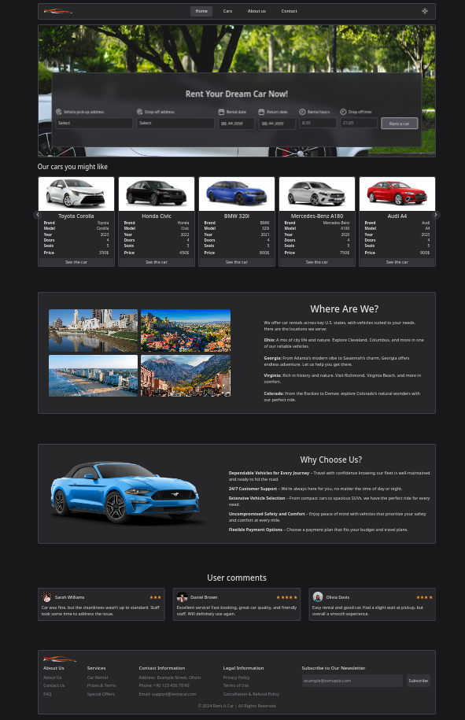

# React Rent A Car

This project is a Rent A Car application where users can list vehicles and view them by filtering according to criteria such as brand, price. The texts and vehicle information in the page content are taken from ChatGPT.

## Used Technologies
1. React Router DOM
2. Redux Toolkit
3. Lucide React
4. Swiper      

## Screenshot
